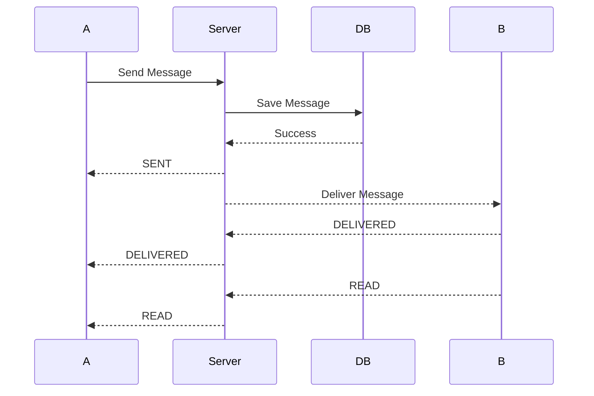

# WhatsApp Backend MVP - System Design

# 1. Architecture

## High-Level Architecture

```text
+----------------+
| Terminal Client|
+-------+--------+
        |
        |
   WebSocket
        |
        v

+----------------------+
|  WebSocket Server    |
|                      |
| ConnectionManager    |
| MessageService       |
| PresenceService      |
| SyncService          |
+----------+-----------+
           |
     +-----+-----+
     |           |
     v           v

 PostgreSQL    Redis
```

---

# 2. Component Design

## ConnectionManager

### Purpose

Maintains active user connections.

### Responsibilities

* Store active sockets
* Map user → connection
* Send messages to users
* Remove dead connections

### Public Methods

connect(user_id, websocket)

disconnect(user_id)

send_to_user(user_id, payload)

is_online(user_id)

---

## MessageService

### Purpose

Manages message lifecycle.

### Responsibilities

* Create messages
* Persist messages
* Update status
* Fetch history

### Public Methods

create_message()

get_conversation()

mark_delivered()

mark_read()

get_pending_messages()

---

## PresenceService

### Purpose

Tracks user availability.

### Responsibilities

* Mark online
* Mark offline
* Store last_seen
* Query presence

### Public Methods

set_online()

set_offline()

get_status()

---

## SyncService

### Purpose

Handles offline message recovery.

### Responsibilities

* Fetch pending messages
* Deliver pending messages
* Update delivery states

### Public Methods

sync_pending_messages()

---

# 3. Database Design

## users

| Column        | Type      |
| ------------- | --------- |
| id            | BIGSERIAL |
| username      | VARCHAR   |
| password_hash | TEXT      |
| last_seen     | TIMESTAMP |

---

## messages

| Column       | Type      |
| ------------ | --------- |
| id           | BIGSERIAL |
| sender_id    | BIGINT    |
| receiver_id  | BIGINT    |
| content      | TEXT      |
| status       | VARCHAR   |
| created_at   | TIMESTAMP |
| delivered_at | TIMESTAMP |
| read_at      | TIMESTAMP |

---

## Indexes

(sender_id, receiver_id)

(receiver_id, status)

(created_at)

---

# 4. Redis Design

## Online User Tracking

Key

online:user:{user_id}

Value

true

---

# 5. Message Lifecycle

## Online Recipient

1. User A sends message.
2. Server saves message.
3. Status = SENT.
4. User A receives single tick.
5. Message routed to User B.
6. User B sends DELIVERED.
7. Status = DELIVERED.
8. User A receives double tick.
9. User B reads message.
10. Status = READ.
11. User A receives blue tick.

---

## Offline Recipient

1. User A sends message.
2. Message persisted.
3. Status = SENT.
4. User B offline.
5. Message retained.
6. User B reconnects.
7. SyncService fetches pending messages.
8. Message delivered.
9. Status = DELIVERED.

---

# 6. Sequence Diagram



---

# 7. Failure Handling

## Recipient Offline

Store message in database.

Deliver later.

---

## Client Disconnect

Remove active connection.

Update last_seen.

---

## Server Restart

Restore state from database.

Users reconnect automatically.

---

## Redis Failure

Presence unavailable.

Messaging continues using PostgreSQL.
